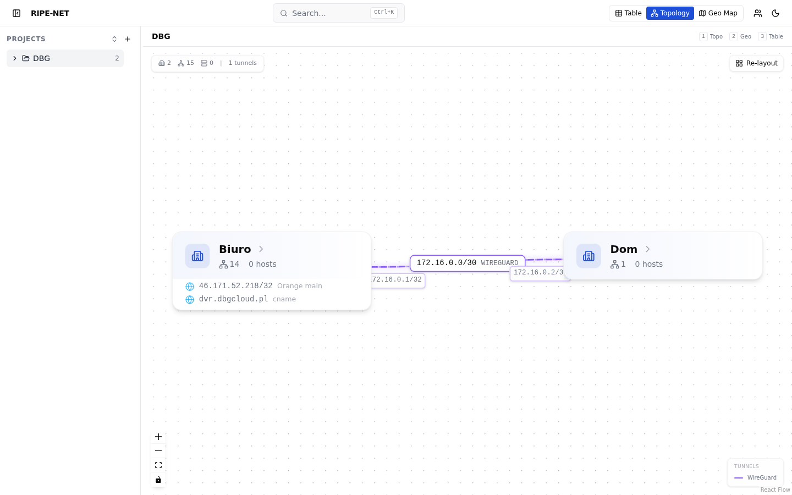
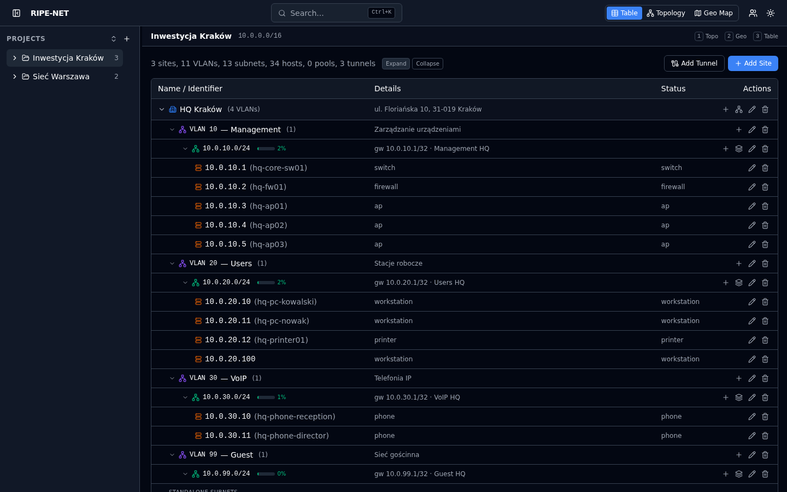
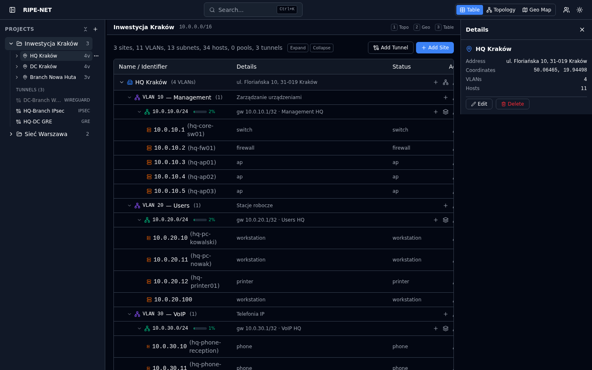
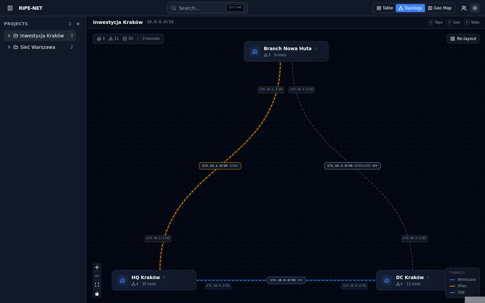

# RipeNet - IP Address Management

Web application for managing IP address infrastructure: projects, sites, VLANs, subnets, hosts, DHCP pools, and network tunnels.

## Stack

- **Backend:** Django 5 + Django REST Framework, PostgreSQL 16 (native CIDR/INET types via django-netfields)
- **Frontend:** React 19 + TypeScript, Vite, Tailwind CSS 4, TanStack Query, Zustand
- **Infrastructure:** Docker Compose, Redis (caching), Nginx

## Features

- Hierarchical network management: Project > Site > VLAN > Subnet > Host
- DHCP pool management with lease tracking and utilization monitoring
- Network tunnels (GRE, IPsec, VXLAN, WireGuard) with cross-project support
- Interactive topology view (React Flow) with drag-and-drop layout
- Geographic map view (Leaflet) for sites with coordinates
- Subnet calculator and VLSM partitioning tools
- Command palette (Ctrl+K) for quick search across all resources
- PDF/Excel export of network documentation
- Audit log with full change history
- Role-based access: admin / editor / viewer
- Dark mode

## Screenshots

### Table view (light)


### Topology view (light)


### Table view (dark)


### Detail panel (dark)


### Topology view (dark)


## Requirements

- [Docker](https://docs.docker.com/get-docker/) (includes Docker Compose)

## Quick Start (step by step)

### 1. Clone the repository

```bash
git clone https://github.com/matziu/ripenet.git
cd ripenet
```

### 2. Create the environment file

Copy the example file and adjust values if needed:

```bash
cp .env.example .env
```

The `.env` file contains database credentials and the admin password. Default values work out of the box for local development - you only need to change them for production.

### 3. Start the app

```bash
docker compose -f docker-compose.dev.yml up --build
```

This single command starts everything: PostgreSQL, Redis, Django backend, and the Vite frontend dev server. On first run it will also download Docker images (~1 min), run database migrations, create an admin user, and load sample network data.

Wait until you see `Local: http://localhost:3000` in the frontend container output.

### 4. Open the app

Go to **http://localhost:3000** in your browser and log in:

| Field    | Value   |
|----------|---------|
| Username | `admin` |
| Password | `admin` |

(or whatever you set as `DJANGO_ADMIN_PASSWORD` in your `.env` file)

### Stopping the app

Press `Ctrl+C`, then run:

```bash
docker compose -f docker-compose.dev.yml down
```

### Starting again (after first setup)

You don't need to rebuild each time:

```bash
docker compose -f docker-compose.dev.yml up
```

## Production

```bash
cp .env.example .env
# Edit .env - set a strong DJANGO_SECRET_KEY and POSTGRES_PASSWORD
docker compose up --build -d
```

This runs:
- Backend with Gunicorn behind Nginx
- Frontend as a static build served by Nginx on port 3000
- PostgreSQL and Redis

## Environment Variables

| Variable | Description | Default |
|----------|-------------|---------|
| `POSTGRES_DB` | Database name | `ripenet` |
| `POSTGRES_USER` | Database user | `ripenet` |
| `POSTGRES_PASSWORD` | Database password | `ripenet` |
| `DJANGO_SECRET_KEY` | Django secret key | `change-me-to-a-random-string` |
| `DJANGO_ADMIN_PASSWORD` | Initial admin password | `admin` |

## Project Structure

```
backend/
  apps/
    accounts/    # User model, auth, admin API
    audit/       # Change tracking
    exports/     # PDF/Excel generation
    ipam/        # VLANs, subnets, hosts, DHCP pools, tunnels
    projects/    # Projects, sites, topology endpoint
    search/      # Global search
    templates/   # Project templates (pre-configured network layouts)
  config/        # Django settings, root URLs
frontend/
  src/
    api/         # Axios client, API endpoints
    components/  # UI components, forms, layout
    hooks/       # React Query hooks (queries, mutations)
    lib/         # Utilities, topology graph logic
    pages/       # Route pages
    stores/      # Zustand stores (UI, selection, topology)
    types/       # TypeScript interfaces
docker/
  Dockerfile.backend
  Dockerfile.frontend
  nginx.conf
  entrypoint.dev.sh
  init-extensions.sql
```

## API

REST API at `/api/v1/` with endpoints:

- `/auth/login/`, `/auth/logout/`, `/auth/me/`
- `/projects/`, `/projects/{id}/sites/`, `/projects/{id}/topology/`
- `/vlans/`, `/subnets/`, `/hosts/`, `/dhcp-pools/`, `/tunnels/`
- `/subnets/{id}/next-free-ip/`, `/subnets/{id}/suggested-pool-range/`
- `/tools/subnet-info/`, `/tools/vlsm/`
- `/search/?q=...`
- `/audit/` (change log)
- `/exports/project/{id}/pdf/`, `/exports/project/{id}/excel/`
- `/users/` (admin only)

## License

MIT
